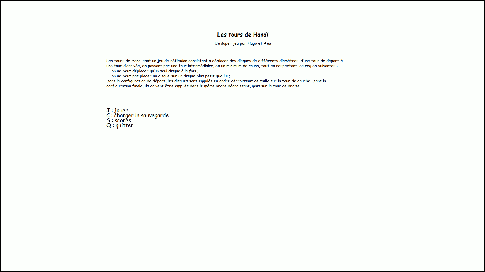
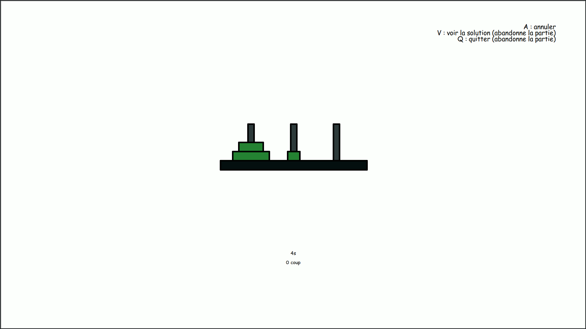
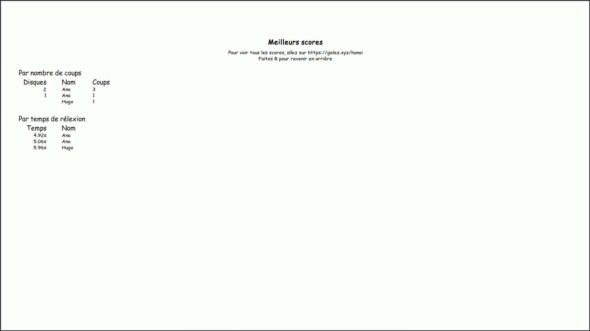

# ProjetINF101 [](https://codecov.io/gh/Projet-INF101/ProjetINF101)

Projet de fin de semestre pour l'UE dINF101. Le but est de créer un jeu de tour de Hanoï en Python. Le sujet est disponible [ici](https://sites.google.com/site/caroleadamphd/teaching/inf101-python/projet-hanoi-v2.pdf?attredirects=0&d=1)

Dépendances et modules utilisés :

- `pickle`, pour la gestion des sauvegardes
- `turtle`, pour l'afffichage
- `time`, pour chronométrer les parties
- `requests`, pour sauvegarder et charger les scores
- `pytest`, pour automatiser les tests

## Captures d'écran







## Tests

Les tests sont dans le dossier `tests`.

Chaque fonction dont le nom commence par "test" est un test, correspondant généralement à une fonction du programme que
l'on souhaite tester.

## Commandes utiles

Récupérer les dépendances (une fois seuleument) :

```bash
pip3 install -U -r requirements.txt
```

Lancer le code :

```bash
python3 __init__.py
```

Lancer les tests :

```bash
pytest
# Ou, si ça ne marche pas
python3 -m pytest
```
